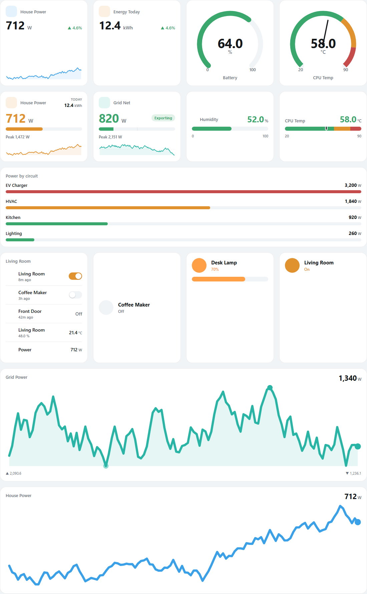

# Prism

[](https://hacs.xyz/docs/faq/custom_repositories/)
[](https://github.com/ryanbuiltthat/prism/releases)

**A flat, minimal, data-first design system for Home Assistant** — a theme plus a
growing set of custom cards built for clean statistics, energy monitoring, and
data display.

Prism is two things working together:

1. **A theme** (`themes/prism.yaml`) that gives native HA a calm, flat look —
   soft surfaces, 1px borders instead of heavy shadows, rounded controls — and
   publishes a set of `--prism-*` **design tokens**.
2. **Custom cards** that read those tokens, so the moment you switch Prism
   themes (or make your own accent), every card re-skins to match.

> Design direction: flat and clear (no 3D / drop shadows), a strong information
> hierarchy (one dominant value per tile), and **never a bare number** — every
> card carries context via a trend, a sparkline, or severity bands.

<picture>
  <source media="(prefers-color-scheme: dark)" srcset="docs/assets/preview-dark.png">
  
</picture>

---

## Cards

| Card | `type` | What it's for |
|------|--------|---------------|
| **Stat** | `custom:prism-stat-card` | KPI tile: dominant value, label, unit, trend delta over a window, optional inline sparkline. |
| **Gauge** | `custom:prism-gauge-card` | Flat 270 degree gauge with configurable severity bands. `fill` or `bands`+needle styles. |
| **Sparkline** | `custom:prism-sparkline-card` | History mini-graph (line/area) with current value + optional min/max markers. |
| **Power** | `custom:prism-power-card` | Live power tile: dominant value, load bar, window peak, optional energy total, and a `grid` mode for signed import/export sensors. |
| **Linear Gauge** | `custom:prism-linear-gauge-card` | Horizontal gauge — one value on a linear scale with severity bands (`fill` bar or band strip + marker). |
| **Bar** | `custom:prism-bar-card` | Horizontal bar chart comparing several entities on a shared scale, with per-bar colour, severity bands, and sorting. |
| **Entities** | `custom:prism-entities-card` | Flat entity list: icon, name, secondary line, and a right-aligned value or a flat toggle for actionable entities. |
| **Filter** | `custom:prism-filter-card` | *Smart* dynamic list: pick a domain + condition (e.g. "lights that are on") and the card fills itself in and re-populates as state changes. `list` or `chips` layout, live match count, empty state, inline toggles. |
| **Switch** | `custom:prism-switch-card` | Toggle tile: icon chip that fills when on, name, and state. Tap to switch, hold for more-info. |
| **Light** | `custom:prism-light-card` | Light tile with a drag brightness slider that adopts the bulb's colour. Tap to toggle, hold for more-info. |
| **Climate** | `custom:prism-climate-card` | Thermostat tile: target temp with − / + steppers, current temp + HVAC action, mode-aware accent. |
| **Cover** | `custom:prism-cover-card` | Cover tile: open / stop / close buttons and an optional drag position slider. |
| **Media** | `custom:prism-media-card` | Media-player tile: album art, what's playing, transport controls, and a volume slider. |

All cards have a **visual editor** with a configurable **title**, an **accent
picker** (theme token, preset, or custom hex), work in **light + dark**, are
keyboard-focusable, and open more-info on tap.

The shared `PrismUI` runtime is built to grow — more cards may follow.

---

## Installation

### Option A — HACS (recommended, for the cards)

Prism isn't in the default HACS store yet, so add it as a **custom repository**:

1. **HACS -> 3-dot menu (top right) -> Custom repositories**
2. Repository: `ryanbuiltthat/prism` &nbsp;·&nbsp; Type: **Dashboard** &nbsp;·&nbsp; **Add**
3. Open **Prism** in the list -> **Download**, then pick a version. HACS adds
   `prism.js` as a dashboard resource for you.
4. Hard-refresh your browser (Ctrl/Cmd + Shift + R).

HACS installs the **cards** (this repo registers as a Lovelace plugin). The
**theme** is a separate file — install it with step 2 below.

### Option B — Manual

**1. Cards (frontend resource)** — copy **`prism.js`** into your HA `config/www/`
folder, then add it as a resource:

**Settings -> Dashboards -> (3-dot menu) -> Resources -> Add resource**
- URL: `/local/prism.js`
- Type: **JavaScript Module**

*(Or, per dashboard, add it under `resources:` in raw YAML.)*

### 2. Theme

Copy **`themes/prism.yaml`** into `config/themes/`, then in `configuration.yaml`:

```yaml
frontend:
  themes: !include_dir_merge_named themes
```

Restart Home Assistant, then pick **Prism** (or a variant) in
**Profile -> Theme**. The variants — *Prism Emerald / Amber / Violet / Slate* —
share the flat base and only change the accent.

---

## Quick start

```yaml
type: custom:prism-stat-card
entity: sensor.power_total
name: House Power
icon: mdi:flash
sparkline: true
trend: true
trend_hours: 24
accent: blue
```

```yaml
type: custom:prism-gauge-card
entity: sensor.battery_soc
min: 0
max: 100
style: fill
segments:
  - { from: 0,  color: red }
  - { from: 20, color: amber }
  - { from: 50, color: green }
```

```yaml
type: custom:prism-sparkline-card
entity: sensor.grid_power
hours: 24
style: area
show_minmax: true
```

```yaml
# Smart card — every light that's currently on, no entity list to maintain.
type: custom:prism-filter-card
title: Lights on
domain: light        # any domain; or use `domains: [light, switch]`
condition: 'on'      # on | off | any | numeric | exact
layout: list         # list (rows) | chips (wrapping grid of pills)
secondary: area      # list only — show each entity's area on the second line
accent: amber
# Other conditions:
#   condition: numeric   → operator: '>'   value: 50   (e.g. sensors above 50)
#   condition: exact     → state_is: playing
```

See [`examples/`](examples/) for full dashboards and [`docs/`](docs/) for the
theming guide and every card option.

---

## Theming & custom colors

Every card resolves its colours from CSS custom properties, so you control the
whole system from the theme:

- `--prism-accent`, `--prism-surface`, `--prism-surface-2`
- `--prism-text-primary`, `--prism-text-secondary`, `--prism-border`
- `--prism-radius`, `--prism-shadow`, `--prism-gap`
- `--prism-good`, `--prism-warn`, `--prism-bad`

To make your **own** colour theme, copy any `Prism ...:` block in
`themes/prism.yaml`, rename it, and change the accent lines. Full details in
[`docs/theming.md`](docs/theming.md).

---

## Development

Cards live in [`src/`](src/) (one file per card + `prism-shared.js`). The
shippable `prism.js` is generated by concatenation — no bundler required:

```bash
./build.sh          # or:  pwsh ./build.ps1   -> regenerates prism.js
node test/smoke.js  # runs card render + helper checks (no browser needed)
```

Open [`test/preview.html`](test/preview.html) in a browser to preview all cards
with mock data — toggle light/dark and accents, no Home Assistant required.

---

## License

MIT © ryanbuiltthat
